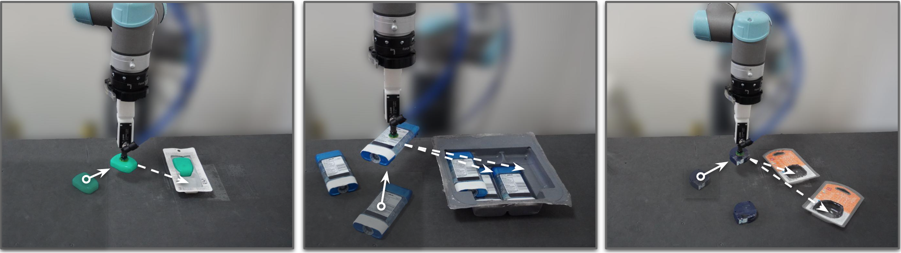

# Form2Fit

Code for the paper

**[Form2Fit: Learning Shape Priors for Generalizable Assembly from Self-Supervised Disassembly][1]**<br/>
*Kevin Zakka, Andy Zeng, Johnny Lee, Shuran Song*<br/>
[arxiv.org/abs/xxxx.xxxxx][2]<br/>
Currently under review.

<p align="center"></p>

This repository provides:

- Code to [download and process](#data) the benchmark datasets.
- Code to [evaluate](#evaluate) a model's performance on the benchmark test set.
- Code to [reproduce](#reproducing-paper-results) the paper results:
	- Architectures, dataloaders and losses for suction, place and matching networks.
	- Planner module for intergrating all the outputs.
  - Baseline implementation.

If you find this code useful, consider citing our work:

```
@inproceedings{zakka2019form2fit,
  title={Form2Fit: Learning Shape Priors for Generalizable Assembly from Disassembly},
  author={Zakka, Kevin and Zeng, Andy and Lee, Johnny and Song, Shuran},
  year={2019}
}
```

## Todos

- [ ] Add the generalization kits to benchmark.
- [ ] Add code to process raw data collection data into Form2Fit format.
- [ ] Add code for training the different networks.

## Setup

Install the repository locally with pip.

```
git clone https://github.com/kevinzakka/form2fit.git
cd form2fit
pip install -e .
```

## Data

Download the [Form2Fit Benchmark](https://www.dropbox.com/s/dc7g4bplrcnca2e/form2fit.zip?dl=0):

```
cd form2fit/form2fit/
chmod +x download_data.sh
./download_data.sh
```

The benchmark currently consists of unique object kits used in the training set of Form2Fit. They are the `black floss`, `tape runner`, `zoo animals` and `fruits` kits. We'll be releasing the multi-object kits (e.g. `deodorant`), novel testing kits and combinations of kits used in the generalization experiments in the coming weeks. Stay tuned!

## Evaluate

Code for evaluating the performance of a model on the benchmark resides in the `benchmark` folder. It reads a pickle file of estimated poses and outputs a pickle file containing computed metrics.

The input pose pickle file is a dictionary with key-values the kits and the associated 25 estimated poses, 1 for each test data.

```
python eval.py ALGORITHM_poses.pkl --debug=False
```
Once the metrics have been calculated, you can plot various accuracy vs threshold curves as so:

```
python auc.py ALGORITHM_acc.pkl
```

## Reproducing Paper Results

The different parts of Form2Fit reside in various subfolders inside the `code` directory.

* `baseline`: run the `ORB-PE` baseline on the benchmark.
* `ml`:
  * `dataloader`: dataloader code for place, suction and matching modules.
  * `models`: network architectures for place, suction and matching modules.
  * `losses.py`: triplet loss with negative mining.
* `gui`: a PyQt GUI for visualizing matching network heatmaps interactively.
* `planner`: contains the planner module code.

You can download model weights by running:

```
chmod +x download_weights.sh
./download_weights.sh
```

[1]: https://form2fit.github.io/
[2]: https://arxiv.org/abs/xxxx.xxxxx
