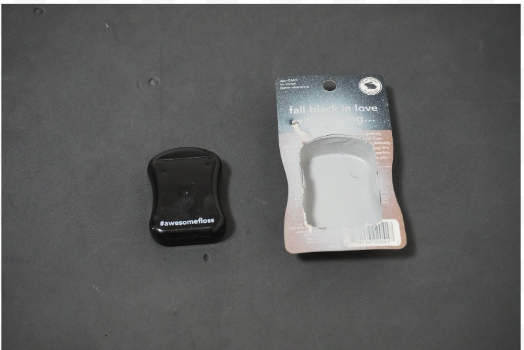
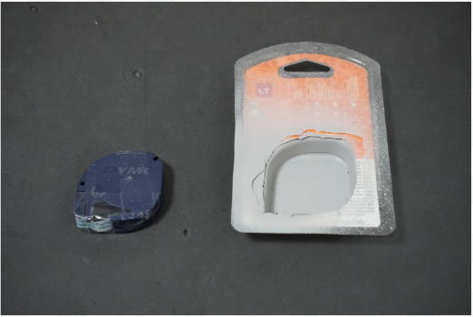
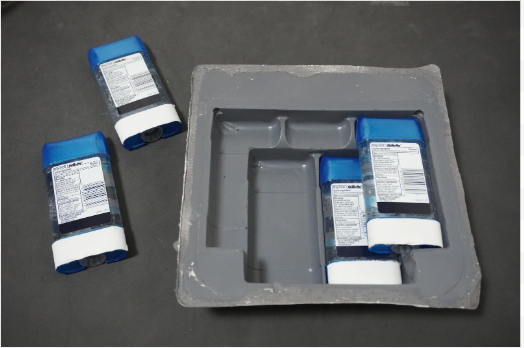
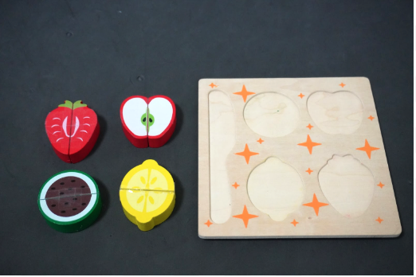
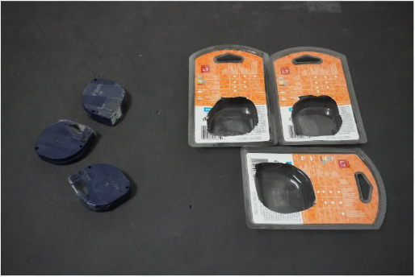
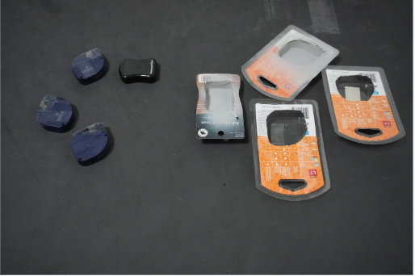
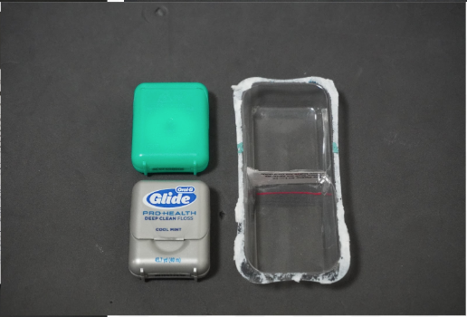
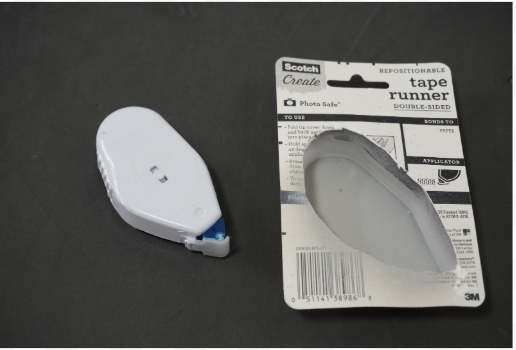
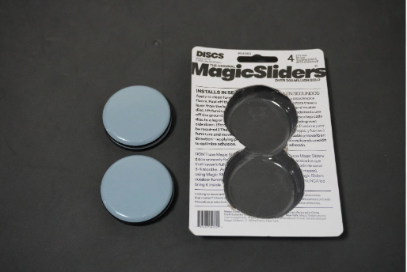
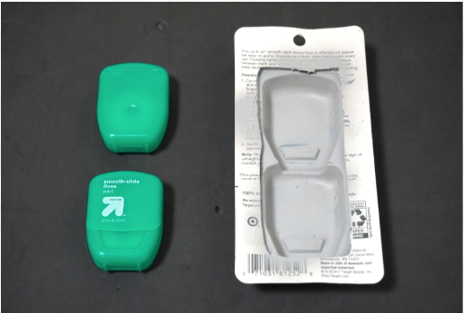

# The Form2Fit Benchmark

**Disclaimer.** The generalization kits are currently only available in raw format. The processed format will be made available in the coming weeks.

We present the **Form2Fit Benchmark**, a dataset for evaluating the generalization capabilities of kit assembly algorithms. It currently consists of:

* 5 training kits
* 6 kit configurations that test for generalization:
    * combinations and mixtures of training kits (x2)
    * novel single and multi object kits (x4)

For all 11 kits, we provide the raw data collected by the robot, as well as the processed format used by `Form2Fit`. Each training kit contains over 500 data points which we split into train, validation and testing splits for model training. For the generalization kits, we provide 20 data points where: we have 5 sets of 4 kit pose samples where in each set, the pose of the kit is fixed but the pose of the objects is randomized. This aligns with the real-world experiments reported in section V.B of the [paper]("").

<p align="center">





</p>

<p align="center">


</p>

<p align="center">




</p>

## Download

We provide a script for downloading and unpacking the dataset under the `form2fit/benchmark/` directory. Execute it as follows:

```
cd form2fit/form2fit/
bash download_data.sh
```

## Data Organization

```
.
├── raw
├── test
└── train
```

The `raw` folder contains the raw (unsurprisingly) data gathered during the self-supervised disassembly pipeline. The `test` folder contains the 6 generalization kits and the `train` folder the 5 training kits.

The train folder contains 5 directories, one for each kit: `black-floss`, `deodorants`, `tape-runner`, `zoo-animals` and `fruits`. Let's dive into the contents of the `deodorants` folder.

**Note.** Files or folders that do not have an associated comment are specific to the Form2Fit architecture and can be ignored for the purposes of the benchmark.

```
.
├── data_indices.npy
├── extr.txt  # the pose of the 3D sensor with respect to the robot base
├── intr.txt  # the intrinsics of the 3D sensor
├── mean_std.p  # the train dataset mean and standard deviation for the grayscale and depth heightmaps.
├── test  # test split
├── train  # train split
└── valid  # validation split
```

In the `train` folder, you will find a folder for each data point. Each folder consists of:

```
.
├── corrs.npy
├── curr_hole_mask.npy  # the pixel mask of the kit hole at the current timestep
├── curr_kit_minus_hole_mask.npy
├── curr_kit_plus_hole_mask.npy
├── curr_object_mask.npy  # the pixel mask of the object at the current timestep
├── final_color_height.png  # the grayscale heightmap
├── final_depth_height.png  # the depth heightmap
├── final_pose.txt  # the object pose when it is outside the kit hole
├── init_color_height.png
├── init_depth_height.png
├── init_pose.txt  # the object pose when it is inside the kit hole
├── placement_points.txt
├── suction_points_final.txt
├── suction_points_init.txt
└── transforms.npy
```