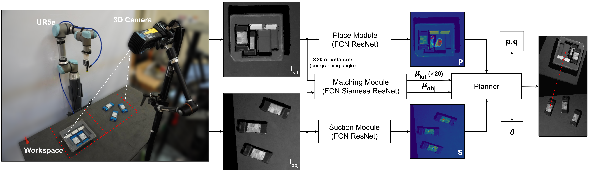
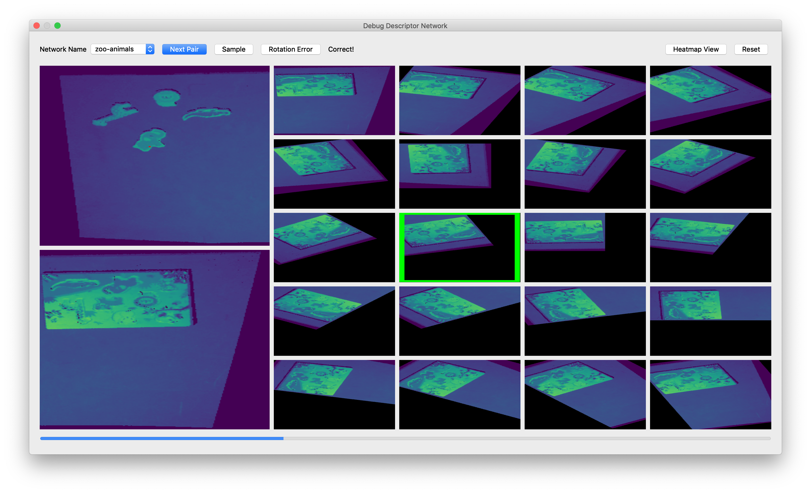

## Paper Code

The different architectural components of Form2Fit reside in various subfolders inside the `code` directory. This does not include code for controlling the UR5e robot or the self-supervised data collection process.

<p align="center">

</p>

## Baseline

To evaluate and compare the baseline performance on the benchmark, cd to the `baseline` folder.

```
python eval_baseline.py
```

This will produce a pickle file of estimated poses called `ORB-PE_poses.pkl`. You can then evaluate its performance by running the [evaluation instructions](./evaluate_benchmark.md) on this pickle file.

You can optionally run the above in debug mode `--debug=True` to plot the ORB descriptors, matches and predicted poses.

## Dataloaders

We provide pytorch dataloaders for the place, suction and matching networks. They can be found in `code/ml/dataloader/`.

The matching module dataloader performs sampling of matches and non-matches for feeding to the contrastive loss function.

## Losses

We provide an implementation of the contrastive loss function with hard negative mining. We also provide a binary cross entropy loss implementation with a dice loss component. You can find the loss functions in `code/ml/losses.py`.

## Planner

The planner module class resides in `code/planner/`. Here's a code snippet for how to use it:

```
planner = Planner((uc, vc))  # instantiate planner with kit center
ret = planner.plan(suction_scores, placement_scores, outs_s, outs_t)  # feed it suction and place heatmaps and descriptor maps

best_place_uv = ret['best_place_uv']
best_suction_uv = ret['best_suction_uv']
best_rotation_idx = ret['best_rotation_idx']
```

## GUI

We provide an interactive GUI for visualizing trained matching network outputs. This can be crucial for debugging and iterating over hyperparameters and designs. The GUI code resides in `code/gui`.

<p align="center">


</p>

For a video of the GUI in action, click [here](https://youtu.be/bkUKCOdVSOQ).